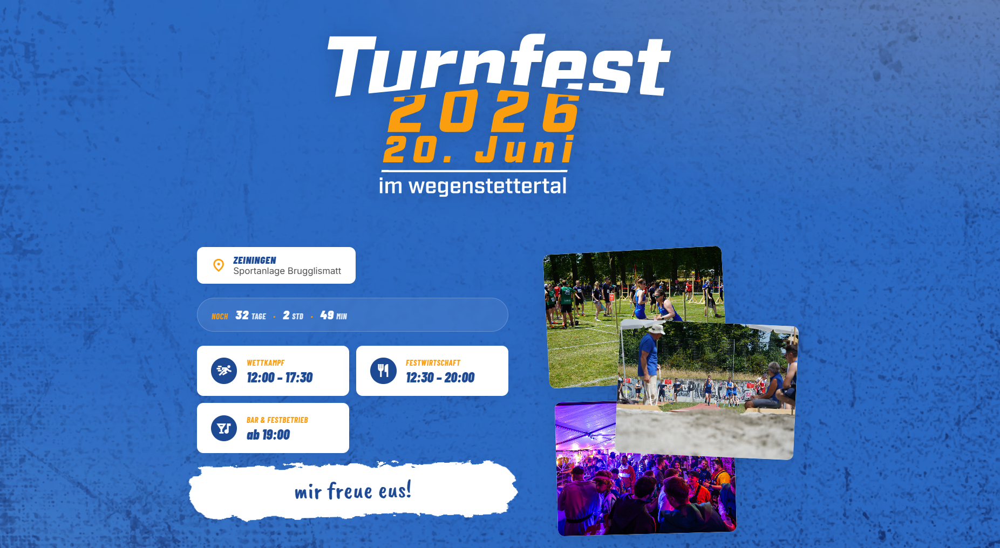

# Turnfest 2026 im Wegenstettertal



Static single-page website for the **Ersatzturnfest 2026** in Zeiningen.

## Tech

- [Astro](https://astro.build/) with TypeScript
- Static output deployed on GitHub pages
- Claude Code

> ℹ️ **AI Disclaimer** 
>
> This website project was mainly created to experiment with AI generation of different media (this website) based on existing hand made media (print flyer).

## Prerequisites

- Node.js **22+**
- pnpm 11+

## Develop

```bash
pnpm install
pnpm dev          # http://localhost:4321
```

## Build

```bash
pnpm build        # outputs to ./dist
pnpm preview      # serves ./dist locally
```

## Deploy to GitHub Pages

Pushes to `main` are built and deployed by `.github/workflows/deploy.yml`.

## Updating content

All event facts live in `src/data/`:

| File | What it contains |
|---|---|
| `event.ts` | Date, location, public time pills |
| `clubs.ts` | The eight participating clubs |
| `disciplines.ts` | Abbreviation → full name + category |
| `stations.ts` | The eight stations on the site plan |
| `schedule.ts` | Per-club schedule entries |
